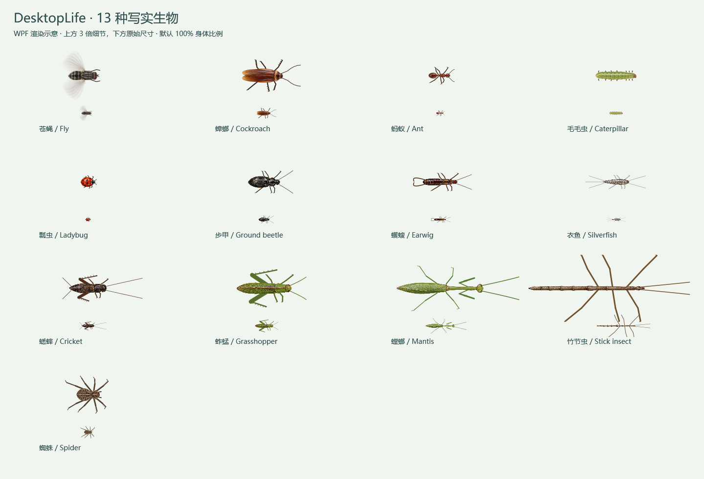
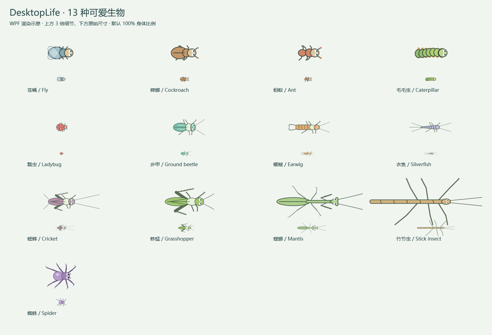
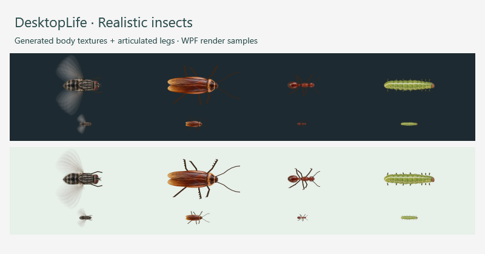
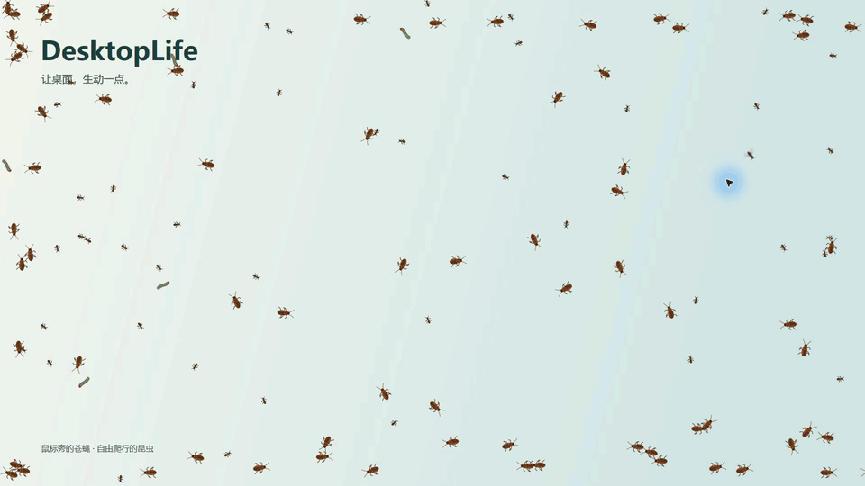
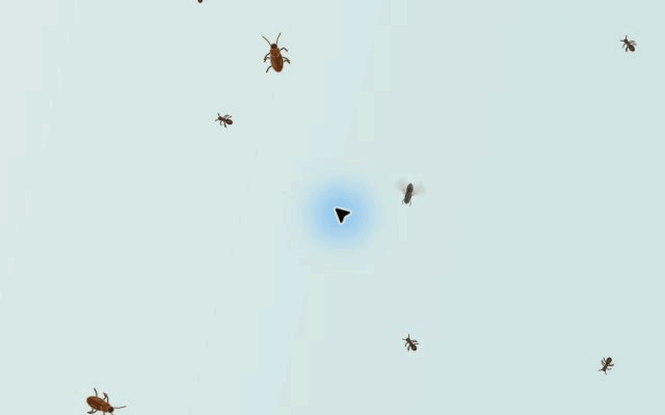
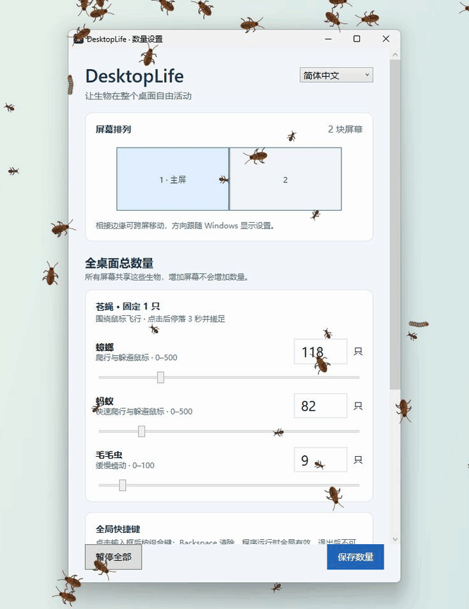

# DesktopLife · Windows Insect Screensaver & Desktop Pets

[简体中文](README.md) · **English** · [Download for Windows](https://github.com/JonGates/DesktopLife/releases) · [Report a bug](https://github.com/JonGates/DesktopLife/issues)

**An insect screensaver and desktop pet app for Windows 10 and Windows 11.** Run autonomous flies, ants, cockroaches and caterpillars while your computer is idle, or keep interactive insect companions on your desktop while you work. Both modes support multiple monitors and configurable populations.

Built with **C# / .NET 10 / WPF / Win32** for **Windows 10/11 x64**. The portable download includes the runtime; extract it and run.

The native **Windows `.scr` screen saver** offers dark/light backgrounds and autonomous insects. Desktop pet mode offers mouse interaction and global pause/resume hotkeys.

## v0.4.0: 12 insect types

Adds **ladybugs, ground beetles, earwigs, silverfish, crickets, grasshoppers, mantises and stick insects** to the original four. Open **More insects** to set each population and size range in desktop or screen saver settings. New species start disabled, with an 80–120% size range.

Each has its own body texture and appendages. Relative body sizes reflect representative insects, not calibrated physical millimeters. In the v0.4.0 download, the eight additions retain realistic appearances in both style modes, with walking, turning and pausing; jumping, predation and takeoff are not simulated. [Species and proportions](docs/INSECTS.md).



## Development preview: cute styles, jumps and flight

Current source and local preview builds include distinct cute appearances for all eight additions in desktop and screen saver modes. Switching preserves populations, sizes and positions. Crickets and grasshoppers now prepare, jump, tuck their legs and settle on landing. Ladybugs open their wings, take off, fly, descend and fold their wings after touchdown. Nearby cursor movement can trigger jumps with a cooldown; pausing freezes all motion. These updates are not yet included in the v0.4.0 downloads below.



## Realistic insect textures and articulated legs

Switch **Creature style** in desktop settings without resetting populations or positions. The screen saver has its own style choice. Flies brake before landing and groom in short bouts; crawlers turn smoothly and animate their gait with distance travelled.

Realistic mode combines AI-generated macro-style body textures with animated legs and antennae. These are generated assets, not documentary photographs. Ants occasionally pause to explore and resume escaping when approached.



## Population, size and settings controls

Per-species minimum and maximum sizes (10–300%). Defaults: cockroaches 60–180%, ants 60–120%, caterpillars 60–140%. Saving applies sizes without resetting positions or populations. Screen saver settings are independent; the fly keeps its original size.

A compact green settings panel groups population and size controls, with collapsible display information, shortcuts and capture options.

## Choose your download

| Experience | Windows x64 portable download | Start here |
| --- | --- | --- |
| Native screen saver for an idle computer, with dark/light themes | **[Screensaver v0.4.0](https://github.com/JonGates/DesktopLife/releases/download/v0.4.0/DesktopLife-ScreenSaver-win-x64-v0.4.0.zip)** | Extract and run `Install-ScreenSaver.cmd`, then choose an idle timeout in Windows. |
| Desktop companions, a mouse-following fly and roaming insects | **[Desktop pets v0.4.0](https://github.com/JonGates/DesktopLife/releases/download/v0.4.0/DesktopLife-Portable-win-x64-v0.4.0.zip)** | Extract and run `Start-DesktopLife.cmd`. |

DesktopLife v0.4.0 is one preview release with two programs: the desktop app and the screen saver. Both include the .NET runtime and keep separate settings. The release contains two ZIPs and one [SHA256SUMS.txt](https://github.com/JonGates/DesktopLife/releases/download/v0.4.0/SHA256SUMS.txt) listing both checksums. [Screen saver guide](docs/SCREENSAVER.md) · [All releases and checksums](https://github.com/JonGates/DesktopLife/releases)



## Download and run

**[Download DesktopLife v0.4.0 for Windows x64 — portable ZIP](https://github.com/JonGates/DesktopLife/releases/download/v0.4.0/DesktopLife-Portable-win-x64-v0.4.0.zip)**

Version **v0.4.0 is a preview release**. [Release notes and checksums](https://github.com/JonGates/DesktopLife/releases/tag/v0.4.0).

### Screen saver v0.4.0

**[Download the self-contained screen saver ZIP](https://github.com/JonGates/DesktopLife/releases/download/v0.4.0/DesktopLife-ScreenSaver-win-x64-v0.4.0.zip)** · [Release notes](https://github.com/JonGates/DesktopLife/releases/tag/v0.4.0)

Extract it, run `Configure-ScreenSaver.cmd` to choose **Dark / Light** and populations, and try `Preview-FullScreen.cmd`. Run `Install-ScreenSaver.cmd` to select it in Windows Screen Saver Settings and set the idle timeout. Move the mouse or press a key to exit. Keep the extracted folder in place. [Full bilingual instructions](docs/SCREENSAVER.md).

### Desktop companion v0.4.0

1. Open the release page and download **`DesktopLife-Portable-win-x64-v0.4.0.zip`** from **Assets**.
2. Extract the entire ZIP into a folder.
3. Double-click **`Start-DesktopLife.cmd`** to launch the app and open settings. You can also run **`DesktopLife.exe`** and double-click its system tray icon to open settings.
4. Choose **English** in the language selector, adjust insect counts, and click **Save population**.

No separate .NET runtime, SDK or Visual Studio installation is required for the portable package. GitHub's **Source code (zip/tar.gz)** downloads contain source files; choose the portable ZIP to run the app.

## Features

| Feature | What it does |
| --- | --- |
| Mouse-following fly | One fly darts and hovers near your cursor. Left-click to choose a landing point; it lands, grooms for 3 seconds, then resumes flying. |
| Configurable insects | Set cockroaches and ants to 0–500 each, and caterpillars to 0–100. Set a species to 0 to disable it. The fly stays fixed at one. |
| Multi-monitor desktop | Creatures cross touching screen edges according to your Windows display layout, including stacked and offset monitors. All monitors share one population. |
| Global hotkeys | **Ctrl+Alt+P** pauses and **Ctrl+Alt+S** resumes. Customize both shortcuts in settings. The app must be running for shortcuts to work. |
| Chinese and English | Settings and tray menus switch language immediately. |
| System tray controls | Close settings to keep insects running. Right-click the tray icon and choose **Exit** to stop the app. |
| Portable Windows app | A self-contained x64 ZIP with the runtime included. Preferences are stored in `%AppData%\DesktopLife`. |

## Live recordings — desktop companion mode

These GIFs were captured from the **primary monitor** while DesktopLife was running, against a static presentation background. The recordings use higher insect counts than the defaults. Close-ups are cropped and resized; motion plays at the captured speed.

### Click, land, groom, and fly again



### Live insects and bilingual settings



## Frequently asked questions

### How do I install a screensaver on Windows 11 or Windows 10?

Download the screen saver ZIP, extract it into a permanent folder, and run `Install-ScreenSaver.cmd`. Select DesktopLife in Windows Screen Saver Settings, choose a wait time and click **Apply**. Use `Configure-ScreenSaver.cmd` for dark/light themes and insect counts. Keep the extracted folder in place.

### Is the screensaver different from desktop pet mode?

The `.scr` screen saver animates insects automatically when Windows starts it after the selected idle time. Mouse or keyboard input exits it. Desktop pet mode stays active while you work: its fly follows your cursor and lands for 3 seconds after a click. Global pause/resume hotkeys belong to desktop pet mode.

### Does adding a monitor add more insects?

All screens share the configured total. Adding or removing a monitor preserves the population. Crawling insects cross edges where screens actually touch; gaps and corner-only connections do not form a crossing route.

### How do I pause or quit?

Use **Ctrl+Alt+P**, the settings button, or the tray menu to pause. Use **Ctrl+Alt+S** to resume. Closing the settings window keeps the app running; choose **Exit** in its tray menu to quit.

### Can I hide the insects during screen sharing?

Settings includes an optional capture-exclusion switch, disabled by default. It uses Windows `WDA_EXCLUDEFROMCAPTURE` and requires Windows 10 version 2004 or later. It works only with compatible capture tools and cannot guarantee exclusion from every recorder. Tray icons and the process remain visible. [Windows API limitations](https://learn.microsoft.com/en-us/windows/win32/api/winuser/nf-winuser-setwindowdisplayaffinity).

## Build from source

Install the **.NET 10 SDK** compatible with [`global.json`](global.json), then run on Windows:

```powershell
git clone https://github.com/JonGates/DesktopLife.git
cd DesktopLife
dotnet build DesktopLife.sln
dotnet test DesktopLife.sln
dotnet run --project src/DesktopLife.App -- --settings
```

Create a self-contained Windows x64 portable package:

```powershell
powershell -ExecutionPolicy Bypass -File scripts/Package-Portable.ps1 -Version 0.4.0
```

Output: `artifacts/DesktopLife-Portable-win-x64-v0.4.0.zip` and its SHA256 file. The `artifacts/` directory is generated locally and excluded from Git.

See the [development and packaging guide (Chinese)](docs/DEVELOPMENT_AND_PACKAGING.md), [recording guide (Chinese)](docs/images/README.md), and [sprite asset notes (Chinese)](src/DesktopLife.Rendering/Assets/README.md).

## Feedback

[Open an issue](https://github.com/JonGates/DesktopLife/issues) with your Windows version, DesktopLife version, monitor arrangement and steps to reproduce the problem. Animation feedback and compatibility reports are welcome.
