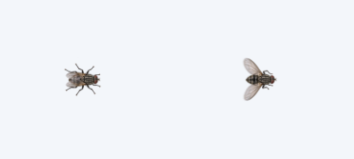

# DesktopLife

Windows 10/11 桌面生物原型，C# / .NET 10 / WPF / Win32。

当前交付：**可调数量 + 共享桌面跨屏移动**。全桌面默认共 1 只苍蝇、20 只蟑螂，通过控制窗口调整总数，不随屏幕数倍增。

## 苍蝇互动

- 苍蝇持续跟随并围绕鼠标飞行，鼠标静止时也不会离开。
- **单击鼠标左键**指定落点。苍蝇先飞过去，实际落下后静止 **3 秒**，再恢复围绕当前鼠标飞行。
- 停落期间移动鼠标不会带走苍蝇；再次点击可指定新落点，同一点再次点击会重新计时。
- 使用写实透明素材，飞行时展翅、停落时收翅。下图为程序实际尺寸下的两种姿态（左停落、右飞行）。
- 点击通过只读系统钩子观察，不消费或阻止原来的点击；本程序设置窗口内的操作不会指定落点。暂停期间的点击不会在恢复后补执行。



素材由内置 imagegen 生成；完整提示词与透明度说明见 [素材说明](src/DesktopLife.Rendering/Assets/README.md)。

## 数量控制与跨屏

- 双击 `Run-DesktopLife.cmd` 打开控制窗口，或双击托盘图标 / 右键选择“数量设置”。程序已运行时再次执行启动脚本，会打开已有实例的设置。
- 苍蝇 **0–20**、蟑螂 **0–500**，输入或拖动滑块，点击 **保存并应用**。0 表示关闭该物种。
- 所有屏幕共享同一批生物。增加数量只补充差额，减少数量保留其余个体；屏幕插拔不改变总数。
- 自动读取 Windows 显示设置中的左右、上下、负坐标与错位排列。同一只蟑螂可从相接的边缘连续爬到邻屏；苍蝇跟随全桌面鼠标。
- 错位屏幕只在实际相接的边缘段通行；没有屏幕的空隙和仅角点接触处不作为爬行通道。若两屏不相接，可在 Windows 显示设置中调整排列。
- 屏幕移除或移动后，仍在有效区域的生物保留状态；失去屏幕的生物移回最近的有效位置，保留身份与总数。
- 关闭设置窗口后继续在托盘运行；“暂停全部 / 恢复全部”控制所有屏幕，暂停中修改数量和接入屏幕仍保持暂停。


## 直接运行

双击根目录 **`Run-DesktopLife.cmd`**，或者 **`artifacts/publish/DesktopLife.exe`**。

- 当前发布包使用本机已有的 **.NET 10 Desktop Runtime x64**，无需重新安装开发环境。
- 请保留 `artifacts/publish/` 内所有文件；不要只复制 exe。
- 启动后稍等，苍蝇会从桌面的外露边缘进入并围绕鼠标。
- 启动后几秒内，蟑螂从屏幕四周陆续爬出。鼠标靠近时会四散，逃到边缘后可藏起来，安全时再出现。
- 右下角系统托盘（可能在折叠区域中）找到 **DesktopLife**，菜单显示屏幕数和总生物数；**暂停 / 恢复 / 退出**同时作用于所有屏幕。
- 只允许运行一个实例；重复打开不会再生成一只苍蝇。
- Release 没有 HUD。Debug 右上角显示输入状态、更新频率、逻辑更新时间、Fly 状态与生物数量。
- 目前没有全局快捷键；`Ctrl + Alt + D` 随后续产品化阶段实现。

## 开发与验证

需要 .NET 10 SDK（本次环境为 10.0.204；`global.json` 固定 SDK 补丁系列）。

源码仓库：[JonGates/DesktopLife](https://github.com/JonGates/DesktopLife)。首次获取源码：

```powershell
git clone https://github.com/JonGates/DesktopLife.git
cd DesktopLife
```

仓库包含源码、测试、脚本和开发文档；`artifacts/`、`bin/`、`obj/` 是本地生成内容，不纳入版本管理。首次克隆后可直接运行根目录启动脚本（需要 SDK），或执行下面的发布脚本生成 `artifacts/publish/DesktopLife.exe`。

```powershell
dotnet build DesktopLife.sln
dotnet test DesktopLife.sln
dotnet run --project src/DesktopLife.App

# 原生窗口样式、焦点与命中测试；先退出已运行的 DesktopLife
powershell -ExecutionPolicy Bypass -File scripts/Test-Overlay.ps1

# 实际 WPF 离屏渲染：100% / 125% / 150%，校验物理坐标与透明度
dotnet run --project tools/DesktopLife.Diagnostics -- artifacts/render-check

# 使用真实 App 生命周期，验证群体可见、暂停停止更新、恢复和退出；先退出现有实例
dotnet run --project tools/DesktopLife.Diagnostics -c Release -- --live artifacts/live-probe

# 使用生产窗口管理器与模拟屏幕布局，验证插拔、负坐标、暂停中接入、分辨率改变
dotnet run --project tools/DesktopLife.Diagnostics -c Release -- --displays artifacts/display-probe

# 实际设置控件、配置保存/错误、全局数量、零数量、暂停和关闭/重开
dotnet run --project tools/DesktopLife.Diagnostics -c Release -- --controls artifacts/controls-probe

# 同一生物跨两个视口，在 100% / 125% / 150% 下拼合一致
dotnet run --project tools/DesktopLife.Diagnostics -c Release -- --seams artifacts/seam-probe

# 实际主循环的点击落点、3 秒停留、暂停恢复与跨屏降落；原生鼠标钩子注册/释放
dotnet run --project tools/DesktopLife.Diagnostics -c Release -- --fly-landing artifacts/fly-landing-probe

# 写实素材飞行/停落两种姿态、透明背景和物理坐标
dotnet run --project tools/DesktopLife.Diagnostics -c Release -- --fly-art artifacts/fly-art-probe

# Release 发布：默认使用已安装的 Desktop Runtime
powershell -ExecutionPolicy Bypass -File scripts/Publish.ps1

# 可选：自带运行时单文件，需下载 Microsoft 官方运行时 NuGet 包
powershell -ExecutionPolicy Bypass -File scripts/Publish.ps1 -SelfContained
```

脚本的 ExecutionPolicy 参数只影响本次 PowerShell 进程，不修改系统策略。

## 架构

| 项目 | 职责 |
| --- | --- |
| `DesktopLife.Engine` | DesktopLayout 的屏幕并集与外露边界、MouseTracker、GameLoop、CreatureManager、SimulationWorld；不引用 WPF / Win32 |
| `DesktopLife.Creatures` | Fly 与 Cockroach 状态机、全局群体差额调整、共享世界与布局同步、邻近避让；仅依赖 Engine |
| `DesktopLife.Windows` | Win32 鼠标采样、只读全局左键观察、显示器枚举与物理矩形、窗口扩展样式 |
| `DesktopLife.Rendering` | 按物种与姿态批量绘制；苍蝇使用嵌入的透明写实图集，蟑螂为两帧矢量素材；素材缓存并 Freeze |
| `DesktopLife.App` | DesktopHost 统一管理每屏视口、单一主循环及鼠标采样、数量控制窗口、JSON 配置、托盘、Debug HUD、异常日志 |

模拟坐标为屏幕物理像素，Renderer 显式减去显示器原点，再除以当前 WPF DPI 比例。Manifest 使用 PerMonitorV2。

Overlay 在显示前配置 `WS_EX_LAYERED | WS_EX_TRANSPARENT | WS_EX_NOACTIVATE | WS_EX_TOOLWINDOW`，去除 `WS_EX_APPWINDOW`；同时使用 `ShowActivated=false`、`SWP_NOACTIVATE` 与消息处理防止激活。穿透依赖原生 layered window 样式，不仅是 WPF 命中开关。技术依据：[Microsoft Window Features](https://learn.microsoft.com/en-us/windows/win32/winmsg/window-features)。

苍蝇默认 `Offscreen → Approach → Orbit`，快速甩动鼠标会短暂 `Panic`；点击进入 `Landing → Landed → Approach`。停落 3 秒从到达落点后开始，使用真实帧间隔；仅在鼠标不属于实际桌面区域时离开。运动步长限制为 50ms。暂停取消更新并清空待处理点击，恢复时重新建立鼠标采样基线。

蟑螂使用 `Hidden → Emerge → Crawl → Panic → Flee` 状态机；到边缘后 Hidden，安全后可恢复 Crawl。个体速度、游走转向、反应时长和逃跑偏角使用可固定种子的随机源。CreatureManager 将只读邻居集合交给行为层，24px 范围内的可见蟑螂互相避让。没有每只生物的定时器或控件。

## 范围与限制

- 支持 Windows x64 多显示器。苍蝇为生成的写实图像，蟑螂仍是程序绘制的占位图形。
- 已通过 Debug / Release 构建和 89 项 xUnit 测试，以及真实控制窗口、双屏窗口、跨屏渲染、点击降落与暂停/恢复检查。详见 `docs/FLY_LANDING_VERIFICATION.md`；旧版本验证记录作为历史保留。
- 尚未完成稳定 60 FPS 和 500 只群体的性能验收；数量上限是输入约束，不代表任何设备均能流畅运行上限数量。
- 125% / 150% 已通过离屏渲染检查，插拔与拓扑变化已通过模拟布局的真实窗口检查；实际混合系统缩放、物理拔插、浏览器点击体验和不同 GPU 尚未完整验收。
- 暂无蚂蚁、开机自启、安装器。
- 数量配置保存在 `%AppData%\DesktopLife\settings.json`；每次保存立即应用，下次启动自动读取。文件损坏或数量无效时使用默认值，并在设置窗口提示；保存失败时保留原数量。
- 异常日志：`%LocalAppData%\DesktopLife\logs\yyyy-MM-dd.log`。
- 自带运行时的发布在本次网络环境下载中断；本次实际交付的是轻量依赖运行时版本。

完整产品规格：`docs/DesktopLife_Codex_Development_Spec.md`；当前计划：`docs/superpowers/plans/2026-09-15-shared-desktop-controls.md`。本次用户要求已取代此前“每屏固定 1/20”的规则。
