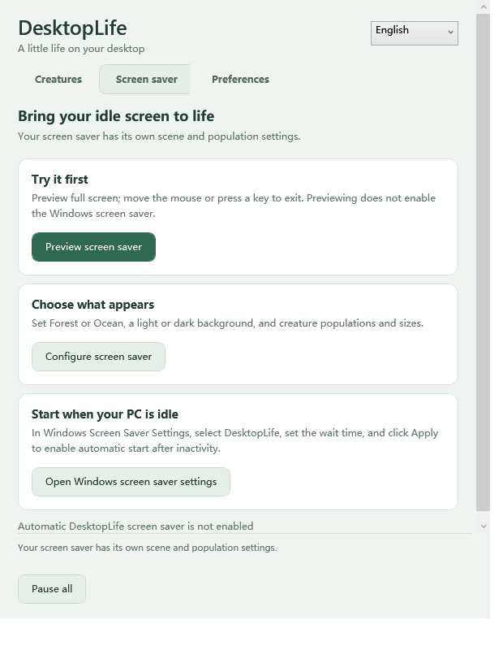
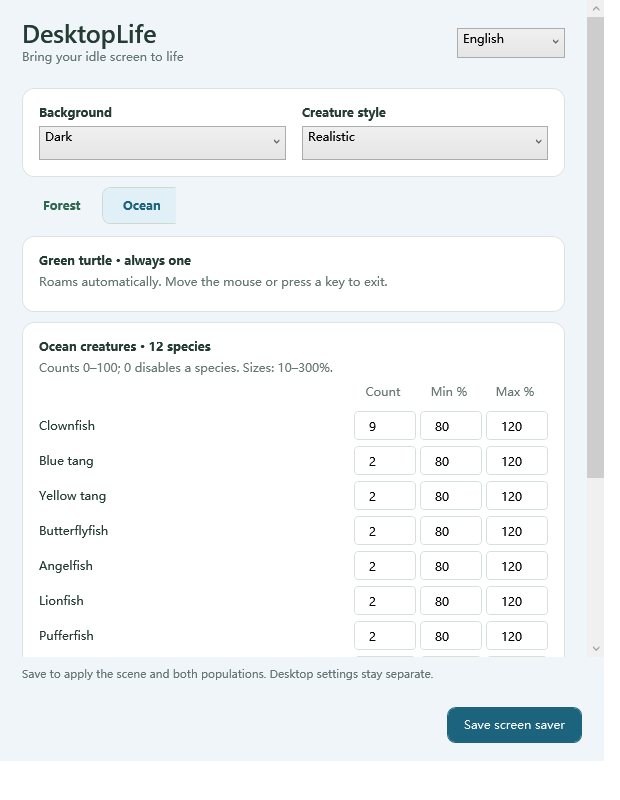

<div align="center">

# DesktopLife

**Turn your Windows desktop into a tiny ecosystem.**

Flies chase your cursor, spiders escape on silk, and a green turtle swims among 12 fish species. Switch between Forest and Ocean, across your monitors or as a native Windows screen saver.

[**Download DesktopLife v5.0.0**](https://github.com/JonGates/DesktopLife/releases/download/v5.0.0/DesktopLife-Portable-win-x64-v5.0.0.zip) · [简体中文](README.zh-CN.md) · [All releases](https://github.com/JonGates/DesktopLife/releases)

Windows 10/11 x64 · 26 creature types across two scenes · Realistic and cute styles · Multi-monitor · Portable

</div>

> **New in v5.0.0:** Forest / Ocean scenes, a cursor-following turtle and 12 fish species, improved spider silk, and redesigned bilingual settings. The main app now includes screen saver preview, configuration and Windows setup. [Release notes](docs/RELEASE_v5.0.0.md).

**Recommended: download the DesktopLife Portable ZIP. It includes both desktop pets and screen saver functionality.** v5.0.0 is a stable release distributed as one application package. [Screen saver guide](docs/SCREENSAVER.md).


> DesktopLife v5.0.0 is a stable release. If it made your desktop more alive—or slightly worse—⭐ star the repository and [tell us which creature should arrive next](https://github.com/JonGates/DesktopLife/issues).

## What lives on your desktop?

DesktopLife is both a **Windows desktop pet app** and a native **`.scr` screen saver**. Choose realistic insects, cute companions, or a mix of both:

**Fly · Cockroach · Ant · Caterpillar · Ladybug · Ground beetle · Earwig · Silverfish · Cricket · Grasshopper · Mantis · Stick insect · Spider**

Ocean adds **Green turtle · Clownfish · Blue tang · Yellow tang · Butterflyfish · Emperor angelfish · Lionfish · Pufferfish · Seahorse · Mandarin fish · Royal gramma · Moorish idol · Six-line wrasse**. [Ocean behavior and sizes](docs/OCEAN.md).

| Feature | What happens |
| --- | --- |
| Cursor-aware fly | A fly darts around your pointer. Left-click to choose a landing spot; it lands, grooms for three seconds, then takes off again. |
| Reactive crawlers | Roaming insects turn, pause and escape when the cursor gets too close. |
| Ocean companions | The turtle follows your cursor; click to send it to a spot where it withdraws into its shell for three seconds. Fish swim head-first with animated fins and tails. |
| Species-specific motion | Crickets and grasshoppers jump. Ladybugs open their wings, take off and land. |
| Realistic or cute | Switch the visual style without resetting populations, sizes or positions. |
| True multi-monitor movement | Creatures cross the edges where monitors touch, including stacked, offset and negative-coordinate layouts. |
| Per-species controls | Forest and Ocean keep separate populations and size ranges. Set a species to zero to hide it. Each scene has one fixed cursor companion. |

## Choose your mode

| | Desktop pets | Screen saver |
| --- | --- | --- |
| Best for | Creatures that stay with you while you work | An animated ecosystem while the PC is idle |
| Interaction | Mouse-following fly or turtle, cursor reactions, pause/resume hotkeys | Autonomous movement; mouse or keyboard exits |
| Display | Transparent overlay across your desktop | Native Windows `.scr` with dark or light background |

Both modes support **Windows 10/11 x64**, include the .NET runtime, and keep their settings separate. No SDK, Visual Studio or separate .NET installation is required.

## Quick start

### Desktop pets

1. Download the **DesktopLife Portable** ZIP above.
2. Extract the entire ZIP into a folder.
3. Double-click **`Start-DesktopLife.cmd`**.
4. On **Creatures**, choose **Forest / Ocean**, adjust counts and sizes, then save. Use **Preferences** for style and hotkeys.

Closing the settings window keeps DesktopLife running in the system tray. Right-click the tray icon and choose **Exit** to stop it.

### Windows screen saver

1. In the main app, open **Screen saver** and configure its scene, dark/light background, style and populations.
2. Preview it immediately; mouse or keyboard input exits.
3. Open **Windows screen saver settings**, select DesktopLife, choose an idle timeout and click **Apply**.

The app prepares a persistent screen saver copy under `%LocalAppData%\DesktopLife\ScreenSaver`. Windows can start it even after the desktop app exits. After upgrading, repeat Windows setup to select the new copy. [Full guide](docs/SCREENSAVER.md).

### Unified settings

| Main app | Screen saver configuration |
| --- | --- |
|  |  |

Both windows support English and Simplified Chinese, resizing and persistent bottom actions. Screen saver settings remain separate from desktop settings.

> GitHub's automatically generated **Source code** archives contain project files, not the ready-to-run Windows app. Download the Portable package above.

## Realistic or cute

| Realistic insects | Cute insects |
| --- | --- |
|  |  |

Realistic mode combines generated macro-style body textures with program-driven legs, antennae and wings. The assets are illustrations, not documentary photographs. Cute mode gives every species a distinct simplified appearance. Both styles are available in desktop and screen saver modes.

## See it in action

### Click, land, groom, fly again


### Live insects and bilingual settings

This recording shows the earlier settings layout; the current v5.0.0 interface is shown above.


## Everyday controls

- **Pause everything:** `Ctrl+Alt+P`
- **Resume everything:** `Ctrl+Alt+S`
- **Change shortcuts:** open settings and edit the Global hotkeys section
- **Change language:** switch between English and Simplified Chinese in settings
- **Change populations or sizes:** save the Insect settings; existing creatures keep their positions where possible
- **Quit:** right-click the DesktopLife tray icon and select Exit

The shortcuts work only while DesktopLife is running. The app allows one instance at a time.

## Frequently asked questions

### Does DesktopLife work with more than one monitor?

Yes. Every monitor shares one configured population. Crawlers cross only where display edges actually touch; gaps and corner-only connections are not treated as paths. Adding, removing or rearranging a display does not multiply the number of creatures.

### Can I hide the insects during screen sharing?

Desktop mode includes an optional capture-exclusion setting, disabled by default. It uses Windows `WDA_EXCLUDEFROMCAPTURE` on Windows 10 version 2004 or newer. Support depends on the capture tool, so it cannot guarantee exclusion from every recorder or monitoring product. The tray icon and process remain visible.

### Where are my preferences stored?

Desktop settings are stored under **`%AppData%\DesktopLife`**. The desktop app and screen saver keep separate configuration files.

### Is this a finished release?

**v5.0.0 is a stable release.** Animation feedback and compatibility reports are especially useful—please include your Windows version and monitor arrangement when reporting a problem.

## Build from source

DesktopLife is built with **C# / .NET 10 / WPF / Win32**. Install the .NET SDK version compatible with [`global.json`](global.json), then run these commands on Windows:

```powershell
git clone https://github.com/JonGates/DesktopLife.git
cd DesktopLife
dotnet build DesktopLife.sln
dotnet test DesktopLife.sln
dotnet run --project src/DesktopLife.App -- --settings
```

Create a self-contained Windows x64 package:

```powershell
powershell -ExecutionPolicy Bypass -File scripts/Package-Portable.ps1 -Version 5.0.0
```

For implementation details, packaging commands and diagnostics, see the [development and packaging guide](docs/DEVELOPMENT_AND_PACKAGING.md). Motion and size behavior are documented in [locomotion](docs/LOCOMOTION.md) and [species and proportions](docs/INSECTS.md).

## Feedback

Found a bug, have a ridiculous creature idea, or tested an unusual monitor layout? [Open an issue](https://github.com/JonGates/DesktopLife/issues).

When reporting a problem, include:

- Windows version
- DesktopLife version
- Monitor arrangement and scaling
- Steps to reproduce the behavior

---

<div align="center">

**If DesktopLife earned a permanent place on your desktop, consider giving it a ⭐.**

[Download v5.0.0](https://github.com/JonGates/DesktopLife/releases/tag/v5.0.0) · [中文说明](README.zh-CN.md) · [Report a bug](https://github.com/JonGates/DesktopLife/issues)

</div>
