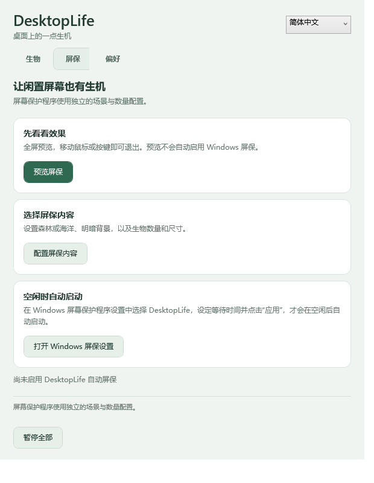
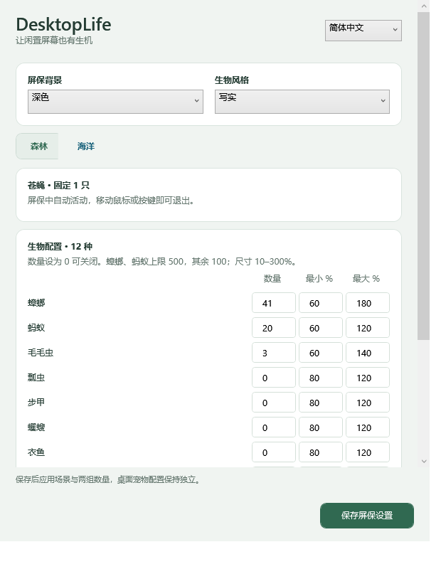

# DesktopLife · Windows 桌面宠物与屏保

[English](README.md) · **简体中文** · [全部版本](https://github.com/JonGates/DesktopLife/releases) · [反馈问题](https://github.com/JonGates/DesktopLife/issues)

**让 Windows 桌面变成一个会动的小生态系统。**

森林里，苍蝇围绕鼠标飞行，昆虫跨屏爬行；海洋里，小绿龟跟随鼠标，12 种鱼自由游动。电脑闲置时，也可以作为 Windows 屏保运行。

**[下载 DesktopLife v0.6.0 主程序包](https://github.com/JonGates/DesktopLife/releases/download/v0.6.0/DesktopLife-Portable-win-x64-v0.6.0.zip)**

Windows 10/11 x64 · 森林与海洋共 26 种生物 · 写实／可爱风格 · 多屏通行 · 自带运行环境

> **v0.6.0 正式版：** 新增繁体中文、日语、韩语，共支持五种界面语言，覆盖主程序、托盘、屏保设置、生物名称与错误提示。[完整更新说明](docs/RELEASE_v0.6.0.md)。
>
> **推荐只下载主程序包：已包含桌面宠物和屏保功能。** v0.6.0 统一发布一个主程序包。


## 下载与开始使用

1. 在 [Release 页面](https://github.com/JonGates/DesktopLife/releases/tag/v0.6.0) 展开 **Assets**，下载 `DesktopLife-Portable-win-x64-v0.6.0.zip`。
2. 完整解压，双击 **`Start-DesktopLife.cmd`** 启动并打开设置；也可运行 `DesktopLife.exe`。
3. 在「生物」页切换「森林／海洋」，调整数量和尺寸并保存；在「偏好」页设置风格、快捷键和录屏选项。
4. 关闭设置后生物继续运行。双击托盘图标重开设置，右键托盘选择「退出」结束程序。

无需安装 .NET、SDK 或 Visual Studio。升级前先从托盘退出旧版，再运行新包；个人配置保存在 `%AppData%\DesktopLife`，可继续使用。

| Release 附件 | 用途 |
| --- | --- |
| `DesktopLife-Portable-win-x64-v0.6.0.zip` | 推荐：主程序，包含桌面宠物、屏保预览、配置与安装入口。 |
| [`SHA256SUMS.txt`](https://github.com/JonGates/DesktopLife/releases/download/v0.6.0/SHA256SUMS.txt) | 主程序 ZIP 的 SHA256 校验值。 |
| Tags 的 `zip` / `tar.gz` 或 `Source code` | 项目源码，不能直接当作便携程序运行。 |

## 从主程序设置 Windows 屏保

1. 打开主程序设置的「屏保」页，点击「配置屏保内容」，选择森林／海洋、深色／浅色背景、生物风格、数量和尺寸。
2. 点击「预览屏保」立即体验；移动鼠标或按键退出，桌面生物恢复此前状态。
3. 点击「打开 Windows 屏保设置」，在系统窗口选择 **DesktopLife**、等待分钟数并点击 **应用**。

完成设置后，Windows 在空闲时自动触发，主程序退出后仍可工作。仅打开程序或预览不会启用自动屏保。程序副本保存在 `%LocalAppData%\DesktopLife\ScreenSaver`；升级后重新点击 Windows 设置入口并应用，更新系统使用的副本。

[屏保详细说明](docs/SCREENSAVER.md)。

## 统一设置界面

| 主程序「屏保」页 | 屏保内容配置 |
| --- | --- |
|  |  |

- 主程序按「生物／屏保／偏好」分组，屏保使用相同的配色、卡片和紧凑输入表格。
- 两个窗口支持简体中文、English、繁體中文、日本語、한국어切换和调整大小，底部操作按钮固定显示。
- 桌面切换森林／海洋立即生效，两套数量与尺寸分别保存。
- 屏保切换标签或语言保留未保存输入，点击保存后应用；桌面和屏保配置互相独立。

## 森林与海洋

**森林 13 种：** 苍蝇、蟑螂、蚂蚁、毛毛虫、瓢虫、步甲、蠼螋、衣鱼、蟋蟀、蚱蜢、螳螂、竹节虫、蜘蛛。

**海洋 13 种：** 小绿龟、小丑鱼、蓝倒吊、黄倒吊、蝴蝶鱼、神仙鱼、狮子鱼、河豚、海马、麒麟鱼、皇家草莓鱼、镰鱼、六线隆头鱼。

| 功能 | 表现 |
| --- | --- |
| 鼠标伙伴 | 每个场景固定 1 只苍蝇或小绿龟，围绕鼠标活动。 |
| 点击停留 | 苍蝇飞到点击位置后停落搓足 3 秒；小绿龟到达后缩壳 3 秒，再恢复跟随。 |
| 物种动作 | 蟋蟀和蚱蜢蓄力跳跃，瓢虫展翅起降，蜘蛛逃跑时吐丝并沿丝移动，鱼头朝向游动方向。 |
| 数量与尺寸 | 每类生物分别设置数量和最小／最大百分比，设为 0 可关闭；固定鼠标伙伴除外。 |
| 写实与可爱 | 两种场景均支持，切换风格保留数量、尺寸和位置。 |
| 多屏通行 | 自动识别 Windows 显示排列，所有屏幕共享数量，相接边缘可以通行。 |

尺寸参考物种轮廓和屏幕可读性，并非真实毫米比例。写实外观使用生成的身体纹理和程序化动作，素材是插画而非实拍照片。[昆虫说明](docs/INSECTS.md) · [海洋说明](docs/OCEAN.md) · [动作说明](docs/LOCOMOTION.md)

## 主屏实录

以下 GIF 录自主屏，展示实际运动；设置 GIF 为旧版布局，新版界面见上方截图。


## 常用操作

- **暂停：** `Ctrl+Alt+P`；**恢复：** `Ctrl+Alt+S`，均可在「偏好」修改。
- **语言：** 设置窗口右上角切换简体中文／English／繁體中文／日本語／한국어。
- **退出：** 右键托盘图标 → 退出。快捷键仅在程序运行时有效。
- **录屏排除：** 桌面模式提供可选设置，效果取决于 Windows 和录制软件，不能保证所有工具都排除；托盘和进程仍可见。

## 开发与验证

使用 C# / .NET 10 / WPF / Win32。安装与 `global.json` 兼容的 SDK，在 Windows 执行：

```powershell
git clone https://github.com/JonGates/DesktopLife.git
cd DesktopLife
dotnet build DesktopLife.sln
dotnet test DesktopLife.sln
dotnet run --project src/DesktopLife.App -- --settings
powershell -ExecutionPolicy Bypass -File scripts/Package-Portable.ps1 -Version 0.6.0
```

[开发与打包指南](docs/DEVELOPMENT_AND_PACKAGING.md)。v0.6.0 为正式版；不同 GPU、实际混合系统缩放与高数量性能仍需要更多设备验证。

欢迎在 [Issues](https://github.com/JonGates/DesktopLife/issues) 提交反馈，并附上 Windows 版本、DesktopLife 版本、显示器排列和复现步骤。如果喜欢这个小生态，欢迎点亮 ⭐。

语言文案内置，无需联网或额外安装语言包。桌面语言即时生效，屏保语言随屏保设置独立保存。[国际化维护指南](docs/LOCALIZATION.md)。
