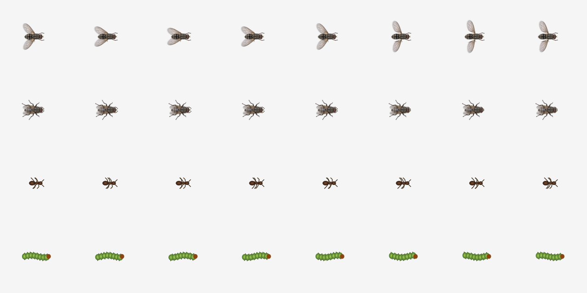

# 昆虫配置与动作验证 · 2026-09-15

- 苍蝇固定一只；蟑螂/蚂蚁 0–500，毛毛虫 0–100。旧 JSON 保留蟑螂数量，新物种使用默认值；保存不再写入苍蝇数量。
- 原写实 PNG 在 WPF 中按身体、翼、前足分层，缓存 8 个动作相位。飞行翼旋转、停落前足搓动，尺寸缩小 40%；没有重新生成或修改原素材。
- 蚂蚁快速爬行并避开鼠标；毛毛虫缓慢爬行，分节身体起伏。两者使用屏幕并集边界约束，接缝可通行，间隙不可跳越。
- Release 构建无警告、无错误；93 项单元测试通过（Engine 29、Creatures 64）。包括新增物种跨接缝、负坐标、2/40px 空隙和非法数量的原子拒绝。
- `--fly-art`：100/125/150% 下飞行/搓足帧不同、透明背景、身体落点锚定、缩小尺寸检查通过。
- `--controls`：实际 WPF 控件保存/校验/重开、暂停恢复、只保留一只苍蝇的零爬虫配置、失败写入不改变数量、旧 JSON 迁移通过。
- `--fly-landing`：生产更新循环验证点击后飞到目标、落地停留 3 秒、暂停冻结、恢复绕鼠标、跨屏降落。使用输入邮箱注入事件；未模拟真实物理鼠标点击。
- 独立代码审查未发现重要缺陷；补上新爬虫对非有限 deltaTime 的防护。

动作相位图（从上到下：飞行、搓足、蚂蚁、毛毛虫；图中以 2 倍大小展示）：

发布后原生双屏覆盖、点击穿透、不抢焦点以及单实例打开设置均通过；新版已运行。
